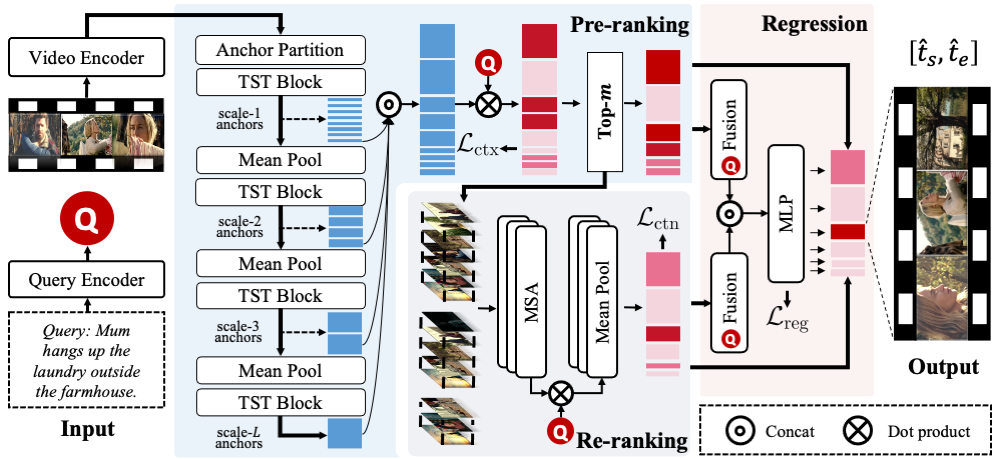

# Scanning Only Once: An End-to-end Framework for Fast Temporal Grounding in Long Videos

[](https://arxiv.org/abs/2303.08345)

This repository is an official implementation of [SOONet](https://arxiv.org/abs/2303.08345). SOONet is an end-to-end framework for temporal grounding in long videos. It manages to model an hours-long video with one-time network execution, alleviating the inefficiency issue caused by the sliding window pipeline. 



## 📢 News
- [2023.9.29] Code is released.
- [2023.7.14] Our paper has been accepted to ICCV 2023!

## 🚀 Preparation

### 1. Install dependencies
The code requires python and we recommend you to create a new environment using conda.

```bash
conda create -n soonet python=3.8
```

Then install the dependencies with pip.

```bash
conda activate soonet
pip install torch==1.13.1+cu117 torchvision==0.14.1+cu117 --extra-index-url https://download.pytorch.org/whl/cu117
pip install -r requirements.txt
```

### 2. Download data
- You should request access to the MAD dataset from [official webpage](https://github.com/Soldelli/MAD). Noded that all our experiments are implemented on MAD-v1.
- Upon completion of the download, extract the zip file contents and allocate the data to the "data/mad" directory.

### 3. Data preprocess

Use the following commands to convert the annotation format and extract the sentence features.

```bash
python preprocess/proc_mad_anno.py
python preprocess/encode_text_by_clip.py
```

The final data folder structure should looks like
```
data
└───mad/
│    └───annotations/
│        └───MAD_train.json
│        └───MAD_val.json
│        └───MAD_test.json
│        └───train.txt
│        └───val.txt
│        └───test.txt
│    └───features/  
│        └───CLIP_frame_features_5fps.h5
│        └───CLIP_language_features_MAD_test.h5
│        └───CLIP_language_sentence_features.h5
│        └───CLIP_language_tokens_features.h5
```

## 🔥 Experiments

### Training

Run the following commands for training model on MAD dataset:

```bash
python -m src.main --exp_path /path/to/output --config_name soonet_mad --device_id 0 --mode train
```

Please be advised that utilizing a batch size of 32 will consume approximately 70G of GPU memory. 
Decreasing the batch size can prevent out-of-memory, but it may also have a detrimental impact on accuracy.

### Inference

Once training is finished, you can use the following commands to inference on the test set of MAD.

```bash
python -m src.main --exp_path /path/to/training/output --config_name soonet_mad --device_id 0 --mode test
```


## 😊 Citation

If you find this work useful in your research, please cite our paper:

```bibtex
@InProceedings{Pan_2023_ICCV,
    author    = {Pan, Yulin and He, Xiangteng and Gong, Biao and Lv, Yiliang and Shen, Yujun and Peng, Yuxin and Zhao, Deli},
    title     = {Scanning Only Once: An End-to-end Framework for Fast Temporal Grounding in Long Videos},
    booktitle = {Proceedings of the IEEE/CVF International Conference on Computer Vision (ICCV)},
    month     = {October},
    year      = {2023},
    pages     = {13767-13777}
}
```

## 🙏🏻 Acknowledgement

Our code references the following projects. Many thanks to the authors.

* [Swin-Transformer-1D](https://github.com/meraks/Swin-Transformer-1D.git)
* [Tensorflow-Ranking](https://github.com/tensorflow/ranking.git)
